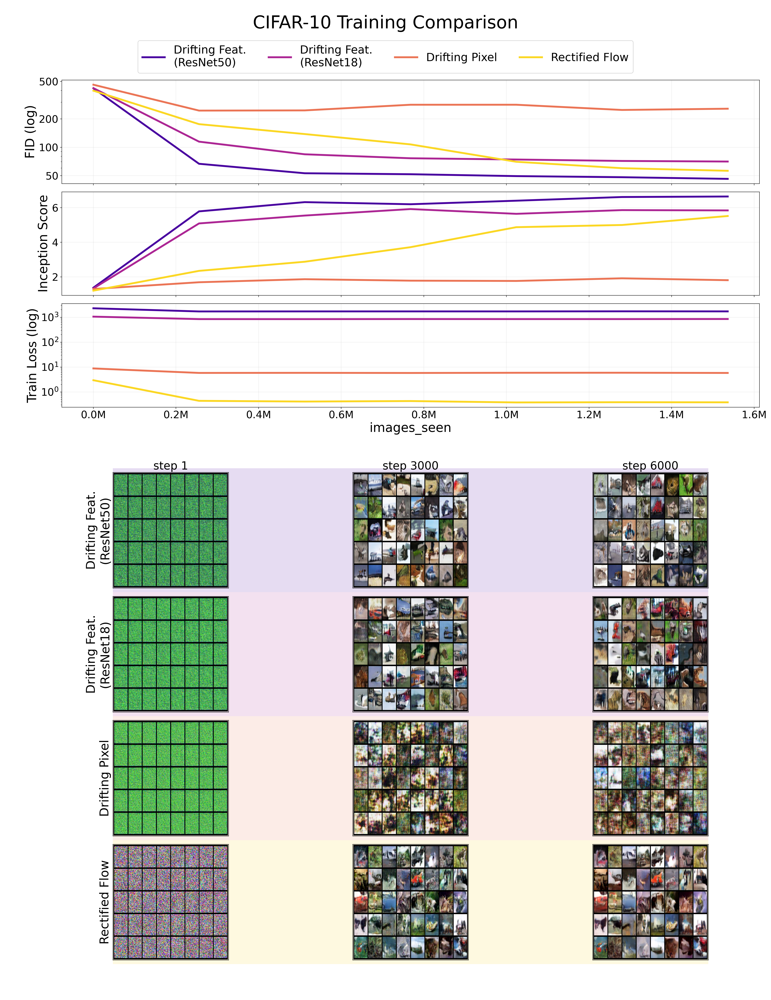
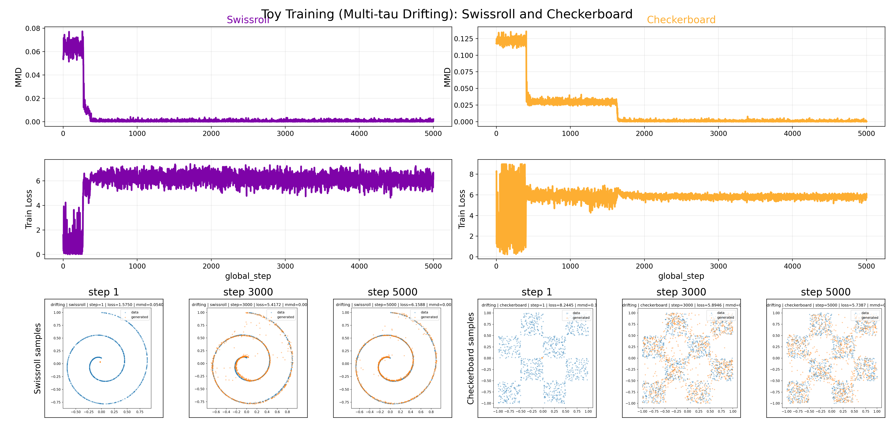
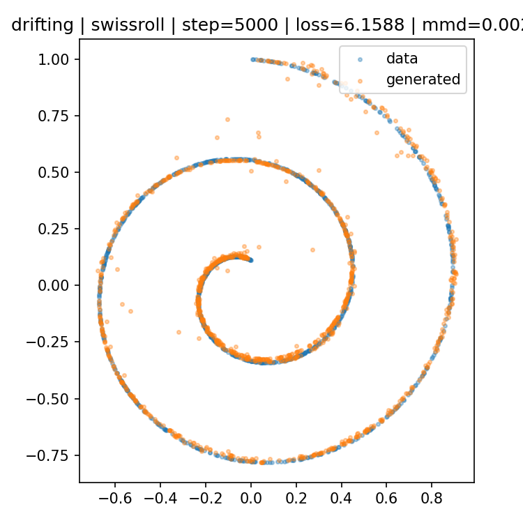
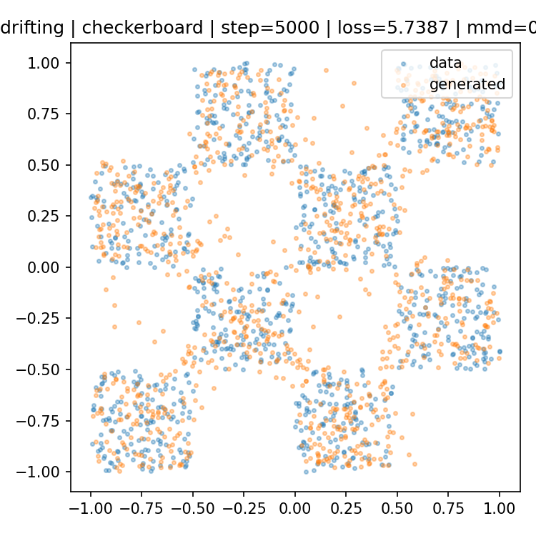

# Generative Modeling via Drifting (PyTorch)

<div align="center">
<a href="https://github.com/yhsure/drifting-models-pytorch/actions/workflows/ci-lint-type.yml" target="_blank"></a>
<a href="https://github.com/yhsure/drifting-models-pytorch/actions/workflows/ci-tests.yml" target="_blank"></a>
<a href="https://github.com/yhsure/drifting-models-pytorch/actions/workflows/ci-precommit.yml" target="_blank"></a>
<a href="https://arxiv.org/abs/2602.04770v2" target="_blank"></a>
</div><br>

> **Generative Modeling via Drifting**<br>
> Mingyang Deng, He Li, Tianhong Li, Yilun Du, and Kaiming He<br>
> <a href="https://arxiv.org/abs/2602.04770v2" target="_blank">*https://arxiv.org/abs/2602.04770v2*</a> <br>
>
> **Abstract:**
> Generative modeling can be formulated as learning a mapping whose pushforward distribution matches the data distribution. We propose *Drifting Models*, a paradigm that evolves the pushforward distribution during training and naturally supports one-step inference. We introduce a drifting field that drives this evolution and reaches equilibrium when generated and data distributions match. This yields a practical training objective that lets standard neural optimization learn a non-iterative generator.

PyTorch implementation of **Drifting Models** for one-step generation following `paper/main.tex` (https://arxiv.org/abs/2602.04770v2).

The available codebases on GitHub are still quite simple and lack most of the details from the paper. This repo has a status like this:

### Implemented now

- [x] Core drifting objective with stop-gradient target.
- [x] Mean-shift attraction/repulsion drifting field from positive/negative samples.
- [x] Softmax-based kernel normalization and multi-temperature support (e.g., `tau in {0.02, 0.05, 0.2}`).
- [x] Toy experiments on swissroll and checkerboard with sample snapshots and MMD tracking.
- [x] Pixel-space training path (CIFAR-10) with feature-space drifting loss.
- [x] Rectified Flow baseline runs with fixed-compute comparison scripts.
- [x] Systematic evaluation pipeline (FID/IS and visual benchmark report).
- [x] Paper-style multi-scale feature extraction for drifting loss (per-scale/per-location descriptors).
- [x] Full feature and drift normalization from Appendix A (shared scale estimation across locations).
- [x] Basic quality automation (`ruff`, `ty`, `pytest`, `pre-commit`, CI workflow).

### Future paper details to implement

- [ ] Hyperparameter tuning and more comprehensive evaluation.
- [ ] Strong custom feature encoders used in paper (ResNet-MAE / ConvNeXt-V2) and related ablations.
- [ ] CFG training/inference path for drifting models (paper Appendix CFG details).
- [ ] ImageNet-scale experiments and paper-like reporting metrics/ablation tables.

## Setup

```bash
uv sync --group dev
uv run pre-commit install
```

## Structure

```text
drifting-models-pytorch/
├── drifting_models_pytorch/          # package source
│   ├── __init__.py                   # exports
│   ├── data.py                       # data
│   ├── drifting_models_pytorch.py    # models + loss
│   └── utils.py                      # helpers
├── examples/
│   ├── train_toy.py                  # toy experiments
│   ├── train_cifar10.py              # CIFAR-10 training
│   ├── compare_methods.py            # fair-compute comparison launcher
│   └── benchmark_cifar_visual.py     # CIFAR visual benchmark orchestrator
├── results/                          # outputs, figures, metrics, samples
├── tests/                            # test suite
├── paper/                            # copied paper assets
└── .github/workflows/                # CI workflows
```

## Figures

### CIFAR-10 (Drifting Feature/Pixel + RF)



### Toy comparison (Swissroll + Checkerboard)



### Toy final samples (matched architecture)

Swissroll (`hidden_dim=384`, `depth=8`, `steps=5000`, multi-tau):



Checkerboard (`hidden_dim=384`, `depth=8`, `steps=5000`, multi-tau):



## Quality Automation

GitHub Actions workflows:

- `.github/workflows/ci-lint-type.yml`
- `.github/workflows/ci-tests.yml`
- `.github/workflows/ci-precommit.yml`

Local commands:

- `uv sync --group dev`
- `ruff format --check`
- `ruff check`
- `ty check`
- `pytest tests/`
- `pre-commit run --all-files`

## Run Experiments

### Toy Data (GPU recommended)

Swissroll:

```bash
uv run examples/train_toy.py --dataset swissroll --method drifting --taus 0.02,0.05,0.2 --batch-size 1024 --dataset-noise 0.0 --hidden-dim 384 --depth 8 --steps 5000 --save-every 1000 --use-output-bound --output-scale 1.0 --outdir results/publication_toy_fixstyle_v3/swiss_drifting
```

Checkerboard:

```bash
uv run examples/train_toy.py --dataset checkerboard --method drifting --taus 0.02,0.05,0.2 --batch-size 1024 --dataset-noise 0.0 --hidden-dim 384 --depth 8 --steps 5000 --save-every 1000 --use-output-bound --output-scale 1.0 --outdir results/publication_toy_fixstyle_v3/checker_drifting
```

Early-stop controls (optional):

```bash
--min-steps 2000 --early-stop-window 200 --early-stop-mmd 0.0020
```

### CIFAR-10 (with a lucidrains U-Net)

Single run (feature drifting):

```bash
uv run examples/train_cifar10.py --method drifting --drifting-mode feature --unet-dim 64 --unet-dim-mults 1,2,4 --outdir results/cifar10/drifting_feature
```

Single run (pixel drifting):

```bash
uv run examples/train_cifar10.py --method drifting --drifting-mode pixel --unet-dim 64 --unet-dim-mults 1,2,4 --outdir results/cifar10/drifting_pixel
```

Single run (rectified flow):

```bash
uv run examples/train_cifar10.py --method rectified_flow --unet-dim 64 --unet-dim-mults 1,2,4 --outdir results/cifar10/rf
```

### CIFAR Visual Benchmark (3-way)

Quick smoke run:

```bash
uv run examples/benchmark_cifar_visual.py --mode quick
```

Full benchmark run:

```bash
uv run examples/benchmark_cifar_visual.py --mode full --export-vector
```

Main output figure:

- `results/figures/cifar_training_comparison.png`

Publication comparison figure (existing runs):

- `results/figures/cifar_training_comparison_flow_r50_r18_pixel.png`
- generated via `results/plot_cifar_existing_comparison.py`

Toy-data comparison figure (swissroll + checkerboard):

```bash
uv run results/plot_toy_existing_comparison.py \
  --swiss-drifting-dir results/publication_toy_fixstyle_v3/swiss_drifting \
  --checker-drifting-dir results/publication_toy_fixstyle_v3/checker_drifting \
  --output results/figures/toy_training_comparison_swiss_checker.png \
  --export-vector
```

## Citing the authors' work

```bibtex
@inproceedings{deng2026drifting,
  title={Generative Modeling via Drifting},
  author={Deng, Mingyang and Li, He and Li, Tianhong and Du, Yilun and He, Kaiming},
  booktitle={International Conference on Machine Learning},
  year={2026}
}
```
