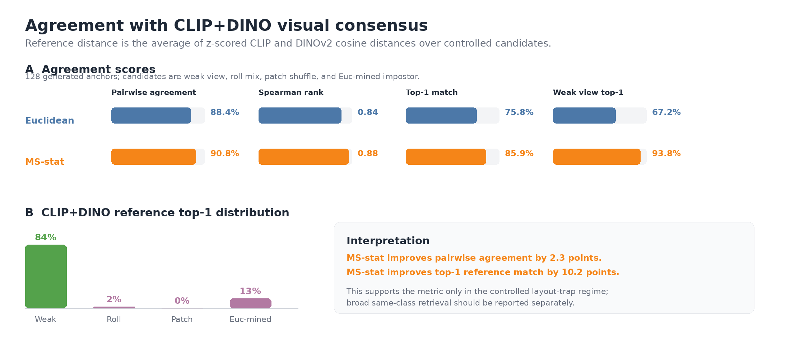

<!-- _class: lead -->

# Drifting and Extensions

<div class="kicker">Method-centric 20k pilots 
<!-- -> MMD -> likelihood prior -->
</div>

The fixed recipe stays still.  
Only support sampling and distance geometry move.


---

## Fixed Base Recipe

All arms share the same ImageNet-256 latent setup:

- config: `configs/gen/latent_sota_B.yaml`
- DiT backbone, optimizer schedule, EMA, CFG setup, and step count held fixed
- `pos_per_sample=64`, `neg_per_sample=32`
- `gen_per_label=64`
- positive bank size 128, negative bank size 1000

The experiment asks which *interaction geometry* gives the best one-step
generator at matched training cost.

---

## Drifting Objective

At each step, generated particles interact with positive and negative support:

$$
x_i \sim q,\qquad y_{\text{pos},j}\in P,\qquad y_{\text{neg},k}\in N.
$$

Distance becomes a temperature-scaled affinity:

$$
a_{ij}(\tau)=\operatorname{softmax}_j\left(-d(x_i,y_j)/\tau\right).
$$

The update field combines attraction and repulsion:

$$
V(x_i;\tau)=
\sum_j r^+_{ij}(y_{\text{pos},j}-x_i)
+\sum_k r^-_{ik}(y_{\text{neg},k}-x_i).
$$


---

## Why Start From Drifting?

The best published drifting models are competitive with much heavier ImageNet
generators while using one network evaluation.

| Method | Space | NFE | FID | IS |
|---|---|---:|---:|---:|
| RAE+DiT-DH XL/2 | latent | 50x2 | **1.13** | 262.6 |
| LightningDiT-XL/2 | latent | 250x2 | 1.35 | 295.3 |
| iMeanFlow-XL/2 | latent | 1 | 1.72 | 282.0 |
| **Drifting L/2** | latent | **1** | **1.54** | 258.9 |
| SiD2 UViT/1 | pixel | 512x2 | **1.38** | -- |
| PixelDiT/16 | pixel | 200x2 | 1.61 | 292.7 |
| StyleGAN-XL | pixel | 1 | 2.30 | 265.1 |
| **Drifting L/16** | pixel | **1** | **1.61** | 307.5 |

The motivation is to understand which support and kernel choices make this
already-strong one-step route more efficient before scaling.

---

## Coupled vs Separate Weights

The original coupled rule uses a joint softmax over generated, negative, and
positive targets, then cross-scales the two sides:

$$
r^-_{ik}=-a^-_{ik}\sum_j a^+_{ij},\qquad
r^+_{ij}=a^+_{ij}\sum_k a^-_{ik}.
$$

The separate-weight ablation normalizes each side independently:

$$
r^-_{ik}=-\tilde a^-_{ik},\qquad
r^+_{ij}=\tilde a^+_{ij}.
$$

Same samples, same support budgets, different coefficient geometry.

---

## Sampling Arms

Let $\mathcal B_{\text{pos}}$ and $\mathcal B_{\text{neg}}$ be class-wise
memory banks.

| Arm | Positive support | Negative support |
|---|---|---|
| `baseline` | uniform | uniform |
| `pos_enhanced` | 48 nearest + 16 random | uniform |
| `neg_enhanced` | uniform | 24 farthest + 8 random |
| `both_enhanced` | 48 nearest + 16 random | 24 farthest + 8 random |
| `importance` | near proposal + uniform mix | far proposal + uniform mix |

The larger bank is a candidate pool. The loss still sees a fixed 64 positive
and 32 negative samples per anchor.

---

## Feature-Anchored Positives

`pos_enhanced_feat` keeps the `pos_enhanced` budget and policy:

$$
P=P_{\text{nearest}}^{48}\cup P_{\text{random}}^{16}.
$$

The only change is the retrieval geometry:

```text
plain pos_enhanced:     nearest in raw latent space
pos_enhanced_feat:      nearest in MAE layer4_mean space
```

MAE features are computed once when the batch is pushed into the memory bank,
then reused for CPU-side neighbor lookup.

---

## Sampling Results

| Arm | FID@20k | IS@20k | P@20k | R@20k | FID@60k | IS@60k | Wall/20k |
|---|---:|---:|---:|---:|---:|---:|---:|
| baseline | 32.09 | 39.67 +/- 0.68 | 0.37 | 0.40 | 13.24 | 96.85 +/- 2.42 | 2h54m |
| pos_enhanced | 29.45 | 43.34 +/- 1.12 | 0.39 | 0.39 | 12.16 | 99.16 +/- 3.16 | 2h55m |
| **pos_enhanced_feat** | **24.68** | **58.03 +/- 1.29** | 0.38 | 0.33 | -- | -- | ~2h55m |
| neg_enhanced | 31.68 | 39.70 +/- 0.41 | 0.38 | 0.41 | 12.96 | 94.79 +/- 3.31 | 3h09m |
| both_enhanced | 37.70 | 35.63 +/- 0.56 | 0.37 | 0.41 | -- | -- | 2h58m |
| importance | 33.18 | 38.19 +/- 0.70 | 0.37 | 0.41 | -- | -- | 3h09m |

Feature-anchored positives give the strongest 20k result in this family.

---

## Main Sampling Read

<div class="two">
<div>

<div class="metric">24.68 FID (-23.1%)</div>

`pos_enhanced_feat` at 20k, cfg=1.0.

Same 64-positive support budget as `pos_enhanced`.

</div>
<div>

<div class="metric">58.03 IS (+33.8%)</div>


Recall drops from 0.394 to 0.329, so the next question is coverage.

</div>
</div>

---

## Kernel Variants

Kernel variants leave sampling fixed and replace only the distance matrix inside
the drift affinity.

<div class="three">
<div>

**V1: multiscale statistics**

Local mean, std, and energy over band-pass and Sobel-gradient maps.

</div>
<div>

**V2: local correlation**

Pooled grid tokens, centered/normalized descriptors, soft row/column alignment.

</div>
<div>

**V3: soft correspondence**

Cosine descriptor cost plus positional regularization, then symmetric soft-min.

</div>
</div>

---

## V1: Multiscale Statistics

Each token map is pooled to a small grid, then processed through a
Laplacian-like pyramid.

For band responses and Sobel-gradient magnitudes:

$$
\mu=\operatorname{mean}_c(z),\qquad
\sigma=\operatorname{std}_c(z),\qquad
e=\operatorname{mean}_c(z^2).
$$

Distance is weighted local-statistic mismatch:

$$
d_{\text{V1}}=\sum_\ell\delta^\ell\left[
\alpha\lVert\mu_x^\ell-\mu_y^\ell\rVert_1+
\beta\lVert\sigma_x^\ell-\sigma_y^\ell\rVert_1+
\gamma\lVert e_x^\ell-e_y^\ell\rVert_1
\right].
$$

`v1_e3`: `alpha=1.0`, `beta=0.5`, `gamma=0.5`, `levels=2`, `grid=4`.

---

## What `levels` and `grid` Mean

<div class="compact">

`grid` controls the statistic-bin layout. With `grid=4`, descriptors are
compared as 4x4 local summaries.

`levels` controls how many pyramid scales contribute. For each level:

1. blur the current map with a 3x3 average filter;
2. compare the high-pass band, `current - blur`;
3. also compare Sobel magnitude of the channel-mean band;
4. downsample the blurred map by 2x for the next level.

For `v1_e3`, level 0 starts at 4x4. Level 1 is coarser, weighted by
`level_decay=0.5`, and its statistics are resized back to 4x4 bins before
the L1 distance is computed.

</div>

---

## V2 and V3: Patch Matching

<div class="compact">

V2 forms all local correlations:

$$
C_{ijab}=\langle \hat u_{i,a},\hat v_{j,b}\rangle
$$

and aggregates them with symmetric log-sum-exp alignment:

$$
s^{\text{local}}_{ij}=
\frac12\left[
\operatorname*{mean}_a\left(\tau_p\log\sum_b e^{C_{ijab}/\tau_p}\right)
+\operatorname*{mean}_b\left(\tau_p\log\sum_a e^{C_{ijab}/\tau_p}\right)
\right].
$$

V3 uses a transport-like cost:

$$
c_{ijab}=1-\langle u_{i,a},v_{j,b}\rangle+
\lambda_{\text{pos}}\lVert\pi_a-\pi_b\rVert^2.
$$

</div>

Both are more correspondence-driven than V1; both were weaker in this 20k pilot.

---

## Kernel Results

| Arm | FID@20k | IS@20k | Wall/20k | Read |
|---|---:|---:|---:|---|
| baseline | 32.09 | 39.67 +/- 0.68 | 2h54m | Euclidean feature distance |
| **v1_e3** | **29.54** | **45.47 +/- 0.71** | 2h56m | best kernel pilot |
| v3_e1 | 33.97 | 36.87 +/- 1.14 | 2h46m | soft transport, too weak here |
| v3_e2 | 35.49 | 36.20 +/- 1.16 | 2h40m | sharper patch temp did not help |
| v2_e4 | 35.67 | 35.48 +/- 0.80 | 3h46m | local corr was expensive |

V1 improved both FID and IS at almost baseline wall-time.


---

## External Visual Consensus Check

Can V1 be justified by an outside visual metric, rather than only by FID?

Reference distance:

$$
d_{\text{ref}}=\frac12 z(d_{\text{CLIP}})+\frac12 z(d_{\text{DINOv2}})
$$

over four controlled candidates per generated anchor:
weak view, roll mix, patch shuffle, and Euclidean-mined layout impostor.

<div class="note">
Result is positive in this controlled layout-trap regime, so it should be
presented as targeted evidence rather than a universal CLIP/DINO agreement
claim.
</div>



---

## Separate Weights

The coefficient ablation removes cross-side mixing while keeping the original
sampling budget.

| Arm | FID@20k | IS@20k | P@20k | R@20k | FID@60k | IS@60k |
|---|---:|---:|---:|---:|---:|---:|
| baseline, coupled | 32.09 | 39.67 +/- 0.68 | 0.37 | 0.40 | 13.24 | 96.85 +/- 2.42 |
| baseline, separate | **30.55** | **41.73 +/- 0.74** | 0.353 | 0.429 | **11.93** | **98.96 +/- 2.45** |

This suggests the coefficient rule itself is a meaningful part of the method,
not just the support set.

---

## Experimental Picture

<div class="big">
The strongest gains came from making the retrieved positives look like the
geometry the loss already uses.
</div>

The next tier is coverage-aware retrieval:

- keep MAE-feature locality where it helps FID and IS;
- preserve more global class coverage;
- avoid changing the expensive drift-loss batch size;
- use larger or static candidate pools only as retrieval machinery.


---

## MMD Objective

`mmd_v1` replaces the designed drift coefficients with the gradient of a
feature-space MMD energy.

For a Gaussian kernel:

$$
k(u,v)=\exp\left(-\frac{\lVert u-v\rVert^2}{2\sigma^2}\right),
$$

the generator-relevant energy is:

$$
E(q,p)=\frac12\mathbb E_{q,q}[k]-\mathbb E_{q,p}[k].
$$

Particles move by the negative gradient:

$$
v(x)=-\nabla_x E(q,p).
$$

Attraction to real features and repulsion among generated features now come
from one energy instead of a hand-designed affinity rule.

---

## MMD Status

The model is mathematically cleaner, but the ImageNet runs are not yet
competitive with the drift pilots.

| Arm | Step | FID | IS | Note |
|---|---:|---:|---:|---|
| `mmd_v1` main | 20k | 61.91 | 24.85 +/- 0.69 | default multi-sigma setup |
| best 2k fix search | 2k | 234.47 | 4.12 +/- 0.05 | `pure_adap1_sig002_dt02_nonorm` |
| 20k tau-corrected iter | 20k | 144.49 | 10.27 +/- 0.23 | improved formulation, still unstable |

Brief ending: MMD is the cleanest energy-based path in the note, but the current
evidence says the sampling and kernel drift variants are the working ImageNet
recipe.

---

<!-- _class: lead -->

# Explicit Likelihood Extension

<div class="kicker">From drifting interactions to semantic responsibilities</div>

The drift experiments improve the support geometry.  
The likelihood work asks whether the generator should also get an explicit
semantic address.

---

## Why Add a Likelihood Prior?

Plain drifting and rectified-flow baselines can generate images, but the latent
random variable is usually implicit: a noise vector goes in, an image comes out.

The mixture idea makes the address visible:

$$
p(x)\approx\sum_k \pi_k p_\theta(x\mid k).
$$

The component variable should not be a class label or a nearest training image.
It should be learned from likelihood in a frozen semantic comparison space.

---

## Current Split

The explicit-likelihood path separates two jobs:

<div class="two">
<div>

**Likelihood prior**

Frozen descriptor space:

$$
v(x)=\frac{\phi(x)-\mu_\phi}{\sigma_\phi}.
$$

Learned Gaussian mixture:

$$
p_\alpha(v)=\sum_k \pi_k\mathcal N(v;c_k,\sigma^2 I).
$$

</div>
<div>

**Image renderer**

Pixel-space, latent-space, flow, or drifting generator:

$$
\hat x=G_\theta(\epsilon,a).
$$

The conditioning vector `a` comes from mixture responsibilities.

</div>
</div>

---

## Responsibilities Are the Interface

For a real descriptor `v_i`, the mixture posterior is:

$$
r_{ik}=p(k\mid v_i)=
\frac{\pi_k\exp(-\lVert v_i-c_k\rVert^2/2\sigma^2)}
{\sum_\ell\pi_\ell\exp(-\lVert v_i-c_\ell\rVert^2/2\sigma^2)}.
$$

Hard conditioning samples one component:

$$
k_i\sim\mathrm{Cat}(r_i),\qquad a_i=e_{k_i}.
$$

Soft conditioning uses the posterior-weighted embedding:

$$
a_i=\sum_k r_{ik}e_k.
$$

---

## Hard vs Soft Prior

Hard-prior training samples one component and gives the renderer a one-hot
address:

$$
k_i\sim r_i,\qquad a=e_{k_i}.
$$

This is a stochastic approximation to a responsibility-weighted conditional
objective:

$$
\mathbb E_{k_i\sim r_i}\mathcal L(x_i,k_i)
=\sum_k r_{ik}\mathcal L(x_i,k).
$$

Soft prior uses the posterior mean embedding instead:

$$
a=\sum_k r_{ik}e_k.
$$

That makes the component address less brittle while keeping sampling tied to
the learned mixture prior.

---

## Relation to Nearby Ideas

`GMFlow` also puts a Gaussian mixture into flow matching, but at each noisy
point: it predicts a dynamic mixture over velocity or denoising targets and
then uses specialized solvers.

This likelihood-prior path keeps the renderer ordinary. The mixture lives in
frozen semantic descriptor space and supplies a global component posterior used
for conditioning and prior sampling.

The GMM-VAE analogy is closer: a mixture prior gives semantic structure. The
difference is that there is no encoder/decoder ELBO here; the descriptor
likelihood defines responsibilities.

---

## CIFAR Prototype Results


| Model | Samples | Steps | FID |
|---|---:|---:|---:|
| RF baseline | 2k | 32 | 55.96 |
| Class-cond flow | 2k | 32 | 52.48 |
| Likelihood flow | 2k | 32 | 49.72 |
| Hard-prior flow | 10k | 64 | 27.91 |
| Soft-prior flow | 10k | 64 | 26.83 |
| **Soft-prior NanoFlow** | 10k | 64 | **26.78** |

The strongest CIFAR result changes how the generator is conditioned: the prior
is learned by likelihood in feature space.

---

## Drifting Variant

The same likelihood prior can condition a one-step drifting generator instead
of an ODE flow.


10k-sample CIFAR comparison:

| Model | Steps | FID |
|---|---:|---:|
| MeanFlow, one-step | 10k | 46.47 |
| Likelihood drift, soft prior | 18k | **41.48** |

The drift version is closer to the ImageNet code path; the flow version is
currently the stronger CIFAR prototype.

---

## ImageNet Likelihood Yardstick

The first ImageNet prototype should live inside the latent drifting setup:

$$
z\in\mathbb R^{32\times32\times4},\qquad
v(z)=\operatorname{pool}(\phi_{\text{MAE}}(z)).
$$

Use a large shared mixture, class-conditional weights, and sparse-soft
responsibilities:

$$
a_i=\sum_{k\in\operatorname{TopK}(r_i,K_{\text{sparse}})}
\tilde r_{ik}e_k.
$$

Reference 5k Torch-port yardstick at `cfg=2.5`:

| Reference | Step | FID | IS |
|---|---:|---:|---:|
| MAE640 baseline | 5k | 29.50 | 51.76 |
| Pos-enhanced feature A | 5k | 24.59 | 68.04 |
| Pos-enhanced feature B | 5k | **23.37** | **75.80** |

---

## Master Takeaway

<div class="big">
There are two complementary levers.
</div>

Drifting experiments improve the interaction field:

- better positive retrieval;
- better distance kernels;
- cleaner coefficient rules;
- explicit MMD energy as a principled alternative.

The likelihood extension adds a learned semantic address:

- a real prior over components;
- hard or soft responsibility conditioning;
- a bridge from CIFAR prototypes back into the ImageNet drifting trainer.
