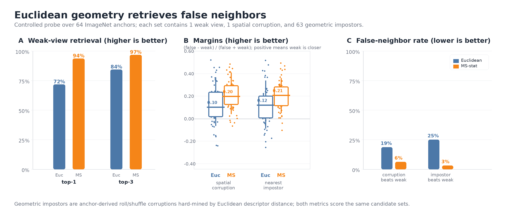
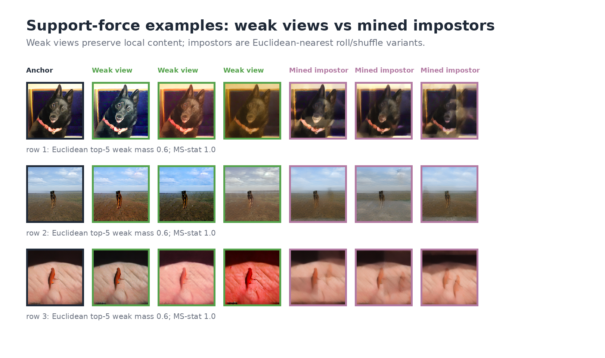
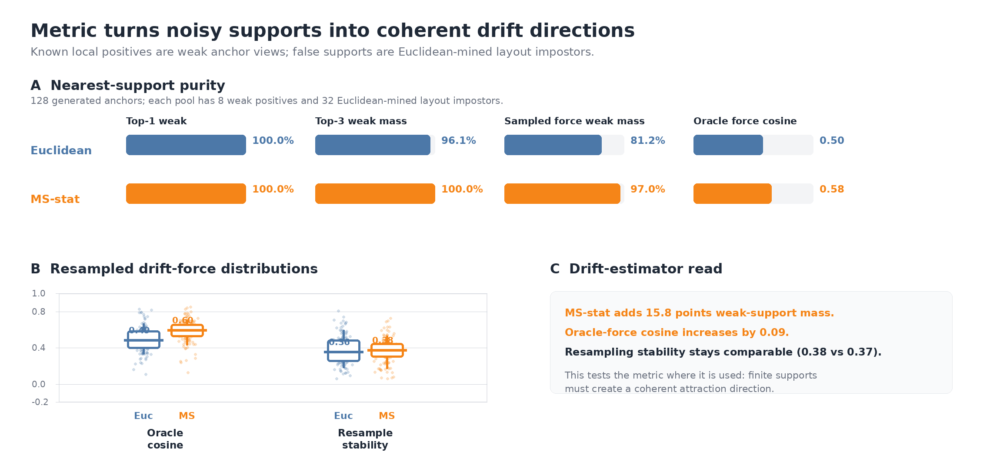
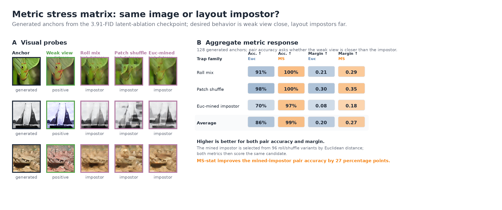

# Metric Experiments

This note summarizes the experiments that motivate replacing Euclidean feature distance with the proposed **MS-stat** distance. MS-stat should be framed as a metric for **local finite-support drift geometry**, not as a generic semantic retrieval metric.

All positive probes use ImageNet latents or generated ImageNet anchors from the latent-ablation checkpoint (`cfg=1.1`). Distances are computed on standardized MAE descriptors. Euclidean uses root-mean-square descriptor distance,

```text
d_E(x, y) = sqrt(mean((phi_E(x) - phi_E(y))^2)).
```

MS-stat uses mean absolute distance between multiscale local-statistic descriptors,

```text
d_MS(x, y) = mean(abs(phi_MS(x) - phi_MS(y))).
```

In the controlled probes, a **weak view** is generated in latent space by channelwise random scale/bias, small Gaussian noise, and a small smoothed residual. It is intended to preserve the local image content. A **spatial corruption** is `0.60 * x + 0.30 * roll_8(x) + 0.10 * patch_shuffle_4x4(x)`. A **mined impostor** is selected from a bank of roll/shuffle latent mixtures by choosing the candidates closest under Euclidean descriptor distance.

## Main Takeaway

**Euclidean is better for broad semantic/category retrieval, but MS-stat is better for the controlled local geometry used by drifting supports.**

The safest paper claim is therefore not “MS-stat is a better visual metric.” The claim is: **MS-stat reduces false local supports and produces a cleaner drift-support signal.**

## 1. False-Neighbor Ranking

This is the primary motivation experiment. For each anchor `x`, the candidate set contains:

- one weak view `w`;
- one spatial corruption `b`;
- 63 Euclidean-mined impostors `u_j`.

For a metric `d`, the weak-view rank is

```text
rank_d(w) = 1 + 1[d(x, b) < d(x, w)] + sum_j 1[d(x, u_j) < d(x, w)].
```

Top-1/top-3 report the fraction of anchors with `rank_d(w) <= 1` or `<= 3`. The false-neighbor rates report how often the corruption or the nearest mined impostor is closer than the weak view. Margins are normalized distance gaps:

```text
corruption_margin_d = (d(x, b) - d(x, w)) / (d(x, b) + d(x, w))
impostor_margin_d   = (min_j d(x, u_j) - d(x, w)) / (min_j d(x, u_j) + d(x, w)).
```

Positive margin means the weak view is closer; negative margin means the false neighbor wins.




| Measure | Euclidean | MS-stat |
|---|---:|---:|
| Weak view top-1 | 71.9% | **93.8%** |
| Weak view top-3 | 84.4% | **96.9%** |
| Corruption beats weak | 18.8% | **6.2%** |
| Impostor beats weak | 25.0% | **3.1%** |
| Median corruption margin | 0.10 | **0.20** |
| Median impostor margin | 0.12 | **0.21** |

Read: Euclidean often ranks a controlled corruption or Euclidean-mined impostor above the weak positive. MS-stat sharply reduces these false-neighbor errors.

## 2. Support-Force Coherence

This experiment evaluates the object the metric actually changes during training: the attraction force induced by a small sampled support set. For each generated anchor, the full pool contains 8 weak views and 32 Euclidean-mined impostors. For each of 24 resamples, we draw 3 weak views and 9 impostors, then let each metric select the top-3 supports.

For selected supports `S_d`, the sampled attraction force is

```text
F_d = mean_{y in S_d}(y) - x.
```

The oracle weak-view force is

```text
F* = mean_{w in all weak views}(w) - x.
```

The reported quantities are:

- **Top-5 weak mass:** fraction of the metric’s top-5 full-pool neighbors that are weak views.
- **Sampled-force weak mass:** fraction of selected top-3 supports that are weak views, averaged over resamples.
- **Oracle-force cosine:** `cos(F_d, F*)`, averaged over resamples and anchors.
- **Resample stability:** average pairwise cosine between `F_d` vectors from different resamples of the same anchor.





| Measure | Euclidean | MS-stat |
|---|---:|---:|
| Top-5 weak mass | 91.6% | **99.2%** |
| Sampled-force weak mass | 81.2% | **97.0%** |
| Oracle-force cosine | 0.50 | **0.58** |
| Resample stability | 0.38 | 0.37 |

Read: MS-stat puts much more of the selected drift force on known local positives and improves alignment with the weak-view oracle direction. Stability is essentially tied, so the claim is better **force coherence/alignment**, not lower variance.

## 3. Generated-Anchor Stress Matrix

This is the most compact visual diagnostic. For each generated anchor, weak view should be close; roll mix, patch shuffle, and Euclidean-mined layout impostors should be far. Pair accuracy is

```text
1[d(anchor, weak) < d(anchor, impostor)].
```



| Trap | Euclidean pair acc. | MS-stat pair acc. |
|---|---:|---:|
| Roll mix | 90.6% | **100.0%** |
| Patch shuffle | 98.4% | **100.0%** |
| Euc-mined impostor | 70.3% | **96.9%** |
| Average | 86.5% | **99.0%** |

Read: the hard-mined impostor row is the key result. Euclidean selects a deceptively close false support; MS-stat still separates it from the weak view.

## 4. External CLIP+DINO Check

This is a targeted external sanity check, not the main claim. For each generated anchor and four controlled candidates (`weak`, `roll`, `patch`, `Euc-mined`), the reference distance is

```text
d_ref = 0.5 * z(d_CLIP) + 0.5 * z(d_DINOv2),
```

where `z` is computed across the four candidates for that anchor. Pairwise agreement is the fraction of candidate pairs for which a metric and `d_ref` induce the same ordering. Top-1 reference match asks whether the metric and `d_ref` choose the same nearest candidate.


| Measure | Euclidean | MS-stat |
|---|---:|---:|
| Pairwise agreement | 88.4% | **90.8%** |
| Spearman | 0.84 | **0.88** |
| Top-1 reference match | 75.8% | **85.9%** |
| Weak-view top-1 | 67.2% | **93.8%** |

Read: this supports MS-stat only in the controlled layout-trap regime. It should not be presented as universal CLIP/DINO agreement.

## Negative Controls

Broad retrieval probes define the boundary of the claim. When the task is generic semantic/category retrieval, Euclidean aligns better with CLIP/DINO.

| Probe | Euclidean | MS-stat |
|---|---:|---:|
| Original JPEG pairs, top-1 CLIP+DINO match | **39.1%** | 30.5% |
| Original JPEG pairs, Spearman | **0.263** | 0.205 |
| Inter-class generated-anchor top-1 match | **46.9%** | 32.8% |
| Broad same-class pilot, top-5 overlap | **38.3%** | 29.2% |

These controls are important: MS-stat is not a better semantic metric in general. It is better for the controlled local support geometry used by the drift estimator.

Saved outputs: `figures/metric_geometry_metrics.json`, `figures/clip_dino_metric_agreement.json`, `figures/support_force_stability.json`, `figures/original_image_pair_clip_dino_agreement.json`, and `figures/interclass_clip_dino_agreement.json`. The broad same-class row is from a quick pilot run rather than a saved JSON.
